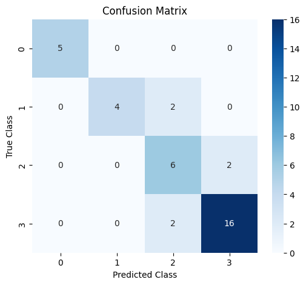
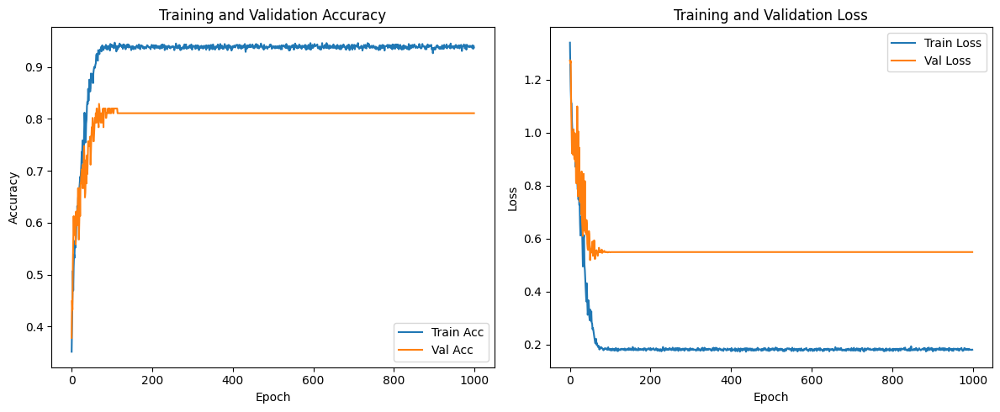
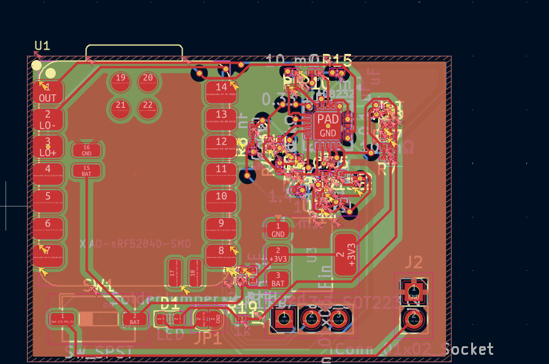
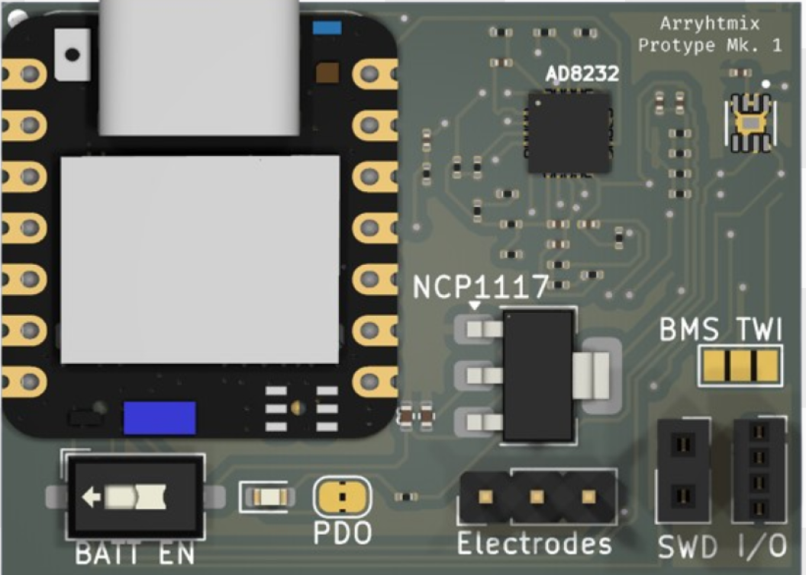
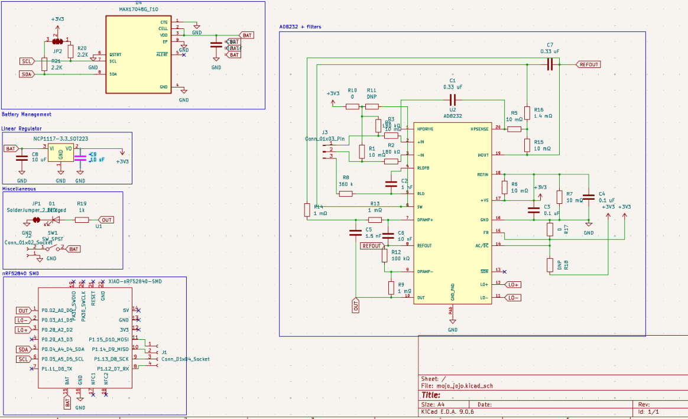

# Main Repo
This is the main repo for the Arryhtmix Project, which aims to develop a novel, end-to-end framework for
the prediction of caridiac events
>
> We have developed a novel end to end pipeline for the prediction of cardiac arrests through machine learning alongside a medical device to facilitate the collection of data for the model.
>
>The initial process takes place on the device. The single-lead AD8232 Sensor with integrated hardware high pass and low pass filters collects ECG Data from one lead with one electrode for common mode rejection. The data is read at a rate of 360 Hz by the nRF52840 using a 12-bit ADC and concurrently denoised through an integrated LSM6DS3. While the device is idle, it is kept in deep sleep mode, significantly reducing power consumption.
>Upon the collection of 10 data points, the buffer is dispatched using BLE to the host device.
>
>Upon being dispatched to the host device, two models are run on it. First, an Arrhythmia classification model based on the MIT-BIH dataset and architected with a BiLSTM and Random Forest classifier returns a dataclass which describes the type of arrhythmia if any. Secondly, a novel model based on the Sudden Cardiac Arrest Holter Database architected by DAKSH EXPLAIN HERE is implemented. This provides  a set of “risk classes” which give the probability of a heart attack happening in the specified timeframe. A f-score of 99 percent and of 85 percent is obtained from both models respectively.
> - ISEF Abstract
### Sections
- [Scripts](scripts)
  - scripts for interfacing and interaction with the device
- [Hardware](Hardware)
  - Device schematics, PCB Design etc.
- [Firmware](src)
  - firmware for the device
- [ML](ML)
  - machine learning stuff

### Images 

 
    
 
    

 

